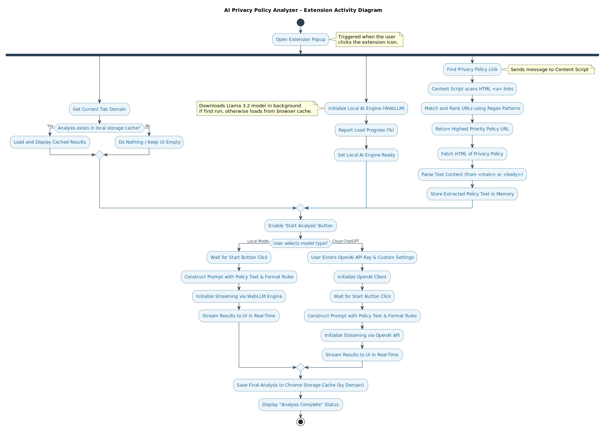

# AI Privacy Policy Analyzer Chrome Extension

## Introduction

The **AI Privacy Policy Analyzer** is a Chrome extension designed to help users understand and critique the privacy policies of websites they visit. It uses advanced AI models, including OpenAI's GPT-3.5-turbo and a local MLC-based AI model, to generate accessible, user-friendly summaries and critiques of privacy policies. This extension empowers users to make informed decisions about their data privacy by identifying vague terms, potential risks, and policy shortcomings.

By leveraging AI-driven language models, the extension ensures that complex legal and technical jargon is translated into clear, concise points. It provides a dual-mode analysis: a local AI model for privacy-conscious users and a cloud-based OpenAI model for higher linguistic sophistication.

---

## Project Setup

1. **Clone the Repository**:
   ```bash
   git clone <repository-url>
   cd ai-privacy-analyzer-chrome-extention
   ```

2. **Install Dependencies**:
   Ensure you have Node.js and npm installed. Run:
   ```bash
   npm install
3. **Build the Extension**:
   Use Parcel to build the project:
   ```bash
   npm run build
   ```

4. **Load the Extension in Chrome**:
   - Open Chrome and navigate to `chrome://extensions/`.
   - Enable **Developer Mode**.
   - Click **Load unpacked** and select the `dist` folder generated during the build process.

5. **Run the Extension**:
   - Click on the extension icon to start analyzing privacy policies directly from your browser.

---

## Architecture

The extension's architecture is divided into key components, each with a specific role in delivering its functionality.

### Operations Flow Diagram
Below is the activity diagram mapping out the end-to-end privacy policy discovery, extraction, and AI-driven analysis flow of the extension:



---

### 1. **Content Script (`content.ts`)**
The content script interacts with the webpage to extract privacy policy links. It uses regular expressions to identify and prioritize URLs related to privacy policies, terms of service, and other legal documents. 

**Insight**:
We experimented with various regex patterns and prioritized them based on real-world testing on diverse websites. The final approach uses a ranked list of patterns, where high-priority matches (e.g., `privacy-policy`) are given preference. The efficient mapping and filtering of URLs ensure robustness, even on websites with non-standard structures. This modular and expandable approach allows easy integration of additional patterns as needed.

```typescript

  const patterns = [
    /privacy-policy\b/i, // highest priority
    /\bprivacy\/policy\b/i,
    /privacy-policy-[a-z]+/i,
    /\bpolicy\/privacy\b/i,
    /\bprivacy\b/i,
    /\bdata-protection\b/i,
    /\bsecurity-policy\b/i,
    /\blegal-notice\b/i,
    /\bcookie-policy\b/i,
    /\bterms-of-service\b/i,
    /\bterms-and-conditions\b/i,
    /\bterms\b/i,
    /\bcompliance\b/i,
    /\bdisclaimer\b/i,
    /\blegal\b/i,
  ];

```

Content scripts send the identified URL back to the extension's opened popup for further analysis.

---

### 2. **Popup Script (`popup.ts`)**
The popup script manages the extension’s user interface. It allows users to start the analysis, switch between the local and cloud models, and view the results. This script interacts directly with the Chrome API to manage user input (API keys, model selection) and provide a seamless experience.

**Insight**:
We focused on usability and interactivity in the popup interface. Feedback guided the development of the model-switching mechanism.

Example:
- Local models excel in maintaining privacy.
- GPT-3.5-turbo, used via OpenAI, provides more detailed and nuanced critiques, especially for complex legal documents.

---

### 3. **Local AI Interface (`localAi.ts`)**
The local AI component powers privacy-conscious analysis without relying on external APIs. It loads a compact model (`Llama-3.2-1B-Instruct-q4f32_1-MLC`) that fits within browser memory, ensuring efficiency and security. The engine processes text in chunks, providing a real-time streaming response.

**NB:** The very first time the extension is used, the local model is downloaded from the server. This process may take a few minutes.

**Insight**:
We tested multiple prompt designs for local models, optimizing them for both speed and clarity. The final implementation uses a sliding window mechanism to handle large documents effectively. Additionally, the response streaming approach ensures real-time feedback, making it highly responsive.

The local engine’s integration:
```typescript
await localAi.chatStream(buildPrompt(privacyPolicy), false, response => {
    updateResult(response);
});
```

This local-first design is ideal for privacy-sensitive applications where users prefer not to share data externally.

---

### Additional Features

- **Caching**: Previous analyses are stored per domain, allowing users to revisit websites without re-analyzing.
- **Real-Time Feedback**: The results are displayed incrementally as the models process the text.
- **Multi-Model Support**: Users can switch seamlessly between OpenAI and local MLC-based models, catering to different needs.
- 
---

## Limitations and Future Improvements

The AI Privacy Policy Analyzer extension is a powerful tool for understanding and critiquing privacy policies. However, it has some limitations and areas for future improvement:

- **Local Model Speed**: The local AI model may not match the linguistic sophistication of cloud-based models like GPT-3.5-turbo. Future updates could include more advanced local models.
- **Privacy Policy Detection**: The current regex-based URL detection may not cover all websites. Enhancements could include machine learning-based URL detection.
- **Dynamic Page Analysis**: The extension currently analyzes static privacy policy pages. Future versions could support dynamic page analysis for websites with JavaScript-based content.
- **User Feedback**: Incorporating user feedback mechanisms could help improve the extension's accuracy and usability.
- **Custom Prompts**: Allowing users to customize prompts for the AI models could enhance the analysis and critique process.
- **Local Model Token Limit**: The local AI model has a token limit that may restrict the analysis of very long privacy policies. Future versions could address this limitation.


## References

Below are some resources and tools that inspired or assisted in the development of this project:

- **WebLLM**: [WebLLM](https://webllm.mlc.ai/) - MLC’s WebLLM project for running large language models in web browsers.
- **WebLLM GitHub Repository**: [WebLLM on GitHub](https://github.com/mlc-ai/web-llm) - Explore the official WebLLM implementation and details.
- **OpenAI API Reference**: [OpenAI API Documentation](https://platform.openai.com/docs/api-reference/introduction) - Comprehensive reference for OpenAI’s API capabilities.
- **Parcel for Web Extensions**: [Parcel Web Extension Recipe](https://parceljs.org/recipes/web-extension/) - Guide for building web extensions with Parcel bundler.
- **Prompting Guide**: [The Prompting Guide](https://www.promptingguide.ai/) - Learn effective techniques and strategies for crafting prompts for AI models.


